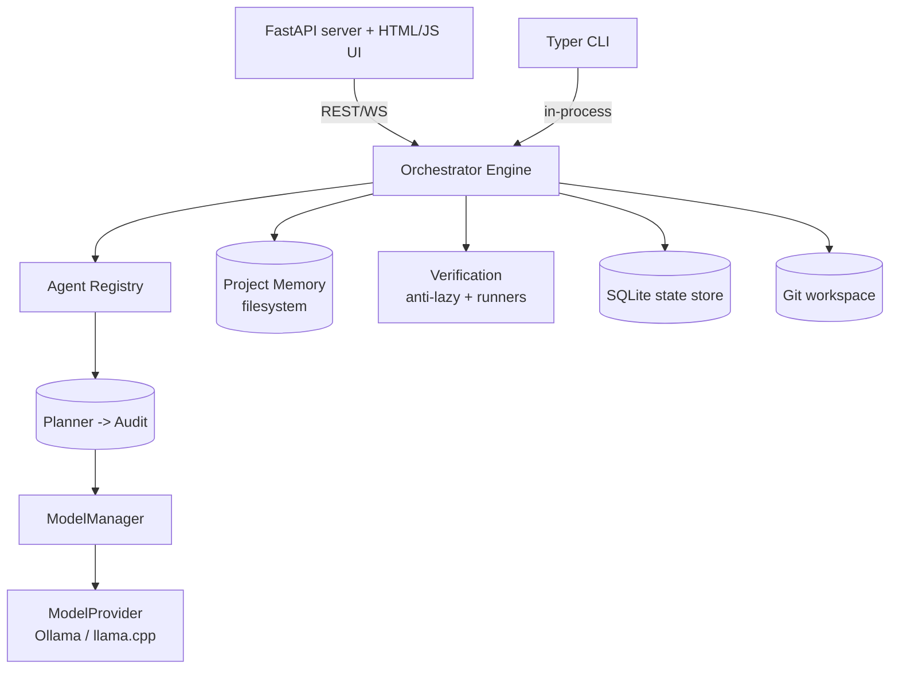

# System Architecture

## 1. Overview

`local-llm-developer` is a sequential, single-host orchestration platform
that drives a team of nine specialised LLM agents to build software
end-to-end. Every architectural choice optimises for **quality** and
**VRAM economy**, in that order. Throughput is explicitly *not* a goal.

The system fits on an 8 GB consumer GPU (RTX 3070) by:

* loading **at most one** model at a time;
* unloading it before the next phase begins;
* using GGUF-quantised models via Ollama (default) or `llama.cpp` (optional);
* keeping all state on the local filesystem + SQLite.



## 2. Layers

| Layer            | Module                       | Responsibility                                        |
|------------------|------------------------------|-------------------------------------------------------|
| Presentation     | `lld.api`, `lld.ui`, `lld.cli` | REST + websocket UI, terminal UX                    |
| Orchestration    | `lld.orchestrator.engine`     | Sequential phase walker, gates, repair loops          |
| Agents           | `lld.agents.*`                | Nine role classes + parser + registry                 |
| Prompts          | `lld.prompts`                 | Markdown role specs + universal anti-lazy charter     |
| Models           | `lld.models.manager/providers`| VRAM-aware single-resident manager                    |
| Memory           | `lld.memory`                  | Sandboxed project workspace + atomic, versioned writes|
| Verification     | `lld.verification`            | Anti-lazy detector + pytest/ruff/mypy runners         |
| Persistence      | `lld.persistence`             | SQLite jobs / phase_runs / events                     |
| Cross-cutting    | `lld.config`, `lld.logging_setup`, `lld.git_integration` | typed config, structured logs, optional Git |

## 3. The Sequential Loop

```
PLAN -> ARCHITECT -> IMPLEMENT -> TEST -> REVIEW -> SECURITY -> REFACTOR
                                      ^                    |
                                      |  loop on failure   v
                                      +-------------------- (max N cycles)
                                                                 |
                                                                 v
                                                            DOCUMENT -> AUDIT
```

Each phase reads its inputs from the **project memory**, runs an agent
against the appropriate model, writes structured artifacts, then yields
control. The orchestrator alone decides whether to advance, retry, or
loop back. Agents are stateless across calls.

## 4. Concurrency Model

The platform is **strictly sequential** for inference. The orchestrator
itself is `asyncio`-based so the API server can stream progress while a
job runs, but every model call is serialised by `ModelManager`'s
async lock. Verification subprocesses (pytest, ruff, mypy) are run
concurrently with each other but never with the LLM.

## 5. Data Persistence

* **SQLite** (`state/orchestrator.db`) — jobs, phase_runs, events.
* **Project workspace** (e.g. `projects/calc-app/`) — canonical artifacts
  (`TASK.md`, `PLAN.md`, ...), `src/`, `tests/`, `docs/`, hand-off
  documents under `handoffs/`, archived prior versions under `artifacts/`,
  and append-only `handoffs/_log.jsonl`.
* **Git** — optional per-phase commits inside the workspace (never the
  platform repo itself).

## 6. Failure Model

* **LLM transport errors** — retried with exponential back-off.
* **Phase timeout** — phase marked `timeout`, job marked `failed`.
* **Anti-lazy violation** — phase marked `failed`; orchestrator either
  retries the phase (implementation) or loops back (test->implementation).
* **Test failures** — orchestrator loops back to `implement` up to
  `max_test_repair_cycles`, then BLOCKS.
* **Low review score** — refactor phase runs, then re-review, up to
  `max_review_cycles`.
* **Audit BLOCKED or low score** — job ends with `status=blocked`.

## 7. Extension Points

* Add new agents by subclassing `lld.agents.base.Agent` and registering
  them in `lld.agents.registry`.
* Add new providers by subclassing `lld.models.providers.ModelProvider`.
* Define alternative workflows by adding YAML files alongside
  `config/workflow.yaml` and selecting them via `--workflow`.
